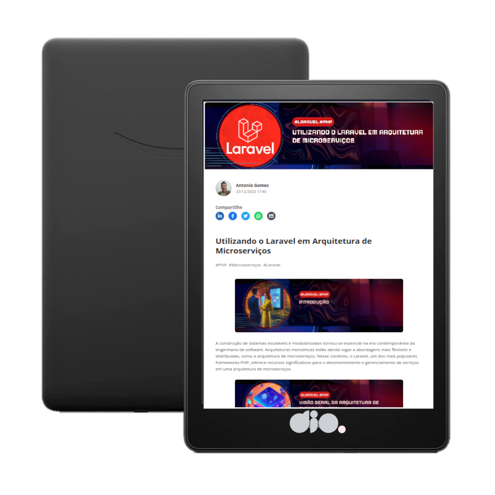

    

  
  

-------

  

# Projeto artigo técnico gerado por I.A.s

 > ℹ️ **NOTE:** Este é o repositório desenvolvido como atividade durante o curso Formação ChatGPT for Devs na plataforma da [DIO](https://dio.me).

  

Projeto com o objetivo de gerar um artigo técnico com um layout rico, leitura agradável e com foco em promover uma autoridade técnica.

<a href="hhttps://www.dio.me/articles/utilizando-o-laravel-em-arquitetura-de-microservicos" title="View PDF now"> 📕Clique aqui para ler o artigo</a>

## 💻 Tecnologias utilizadas no projeto

- [ChatGPT](https://chat.openai.com/) - Especificamente para o conteúdo
- [Lexica.art](https://lexica.art/) - Para gerar imagens
- [Canva](https://www.canva.com) - Para formatação de banners e Layouts
- [Gimp](https://www.gimp.org) - Para tratamento de imagens

## 📄 Prompts e ferramentas

ChatGPT：

|   Ação   | prompt                                                                                                                                                                                                                                                                         |
| :------: | ------------------------------------------------------------------------------------------------------------------------------------------------------------------------------------------------------------------------------------------------------------------------------ |
|  conteúdo  | Crie um artigo técnico que explique a utilização do Laravel em uma arquitetura de microserviços                                                                                                                                                                                                     |
| conteúdo | Dê exemplos de código para a aplicação do artigo descrito  |

Lexica.art：

- No léxica utilizei o acervo público de imagens geradas por outras pessoas, os termos de pesquisa que utilizei foram:

• laravel microserviços
• microserviços
• introduction
• conclusion
• examples
• production sources
• users
• products
• observation

## ✨ Features

- Conteúdo gerado via ChatGPT
- Imagens do acervo público geradas via Lexica.art
- Imagens editadas com Canva e Gimp

## 📚 Materiais

- prompts utilizados

## 🛠️ Instruções de execução

Utilize os prompts acima nas ferramentas sugeridas para gerar o material base e utilize uma ferramenta de edição de imagens como Gimp e Canva para diagramação, o passo a passo em vídeo pode ser conferido na plataforma da [DIO](https://dio.me).

## 👨‍💻 Expert

    
    
&nbsp&nbsp&nbspAntonio Carlos Gomes 
    &nbsp&nbsp&nbsp
    <a href="https://github.com/acgomes68">
    GitHub</a>&nbsp;|&nbsp;
    <a href="https://www.linkedin.com/in/antonio-carlos-gomes/">LinkedIn</a>
&nbsp;|

  

---

⌨️ com 💜 por [Antonio Carlos Gomes](https://github.com/acgomes68)